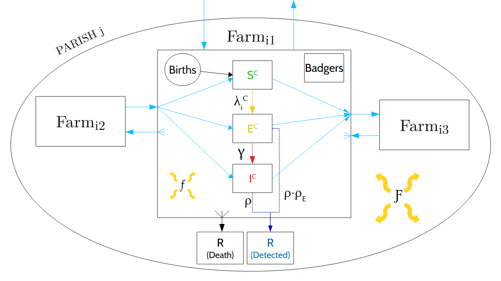
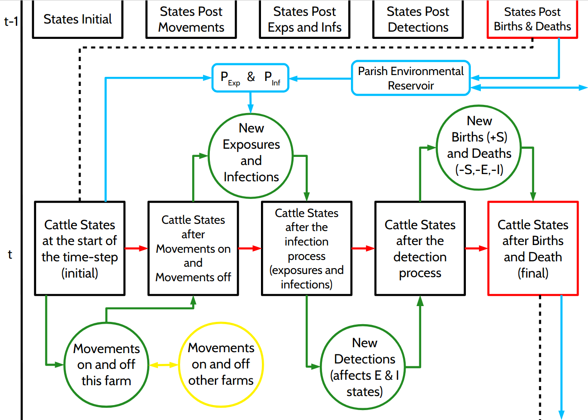

# Bovine Tuberculosis

This repository contains the code for modelling the spread of bovine Tuberculosis in England and Wales using data provided by the APHA. This work forms a core chapter of my PhD thesis. This is my working directory which will be processed into a final product for the thesis chapter directory.

#### Language:
Julia

#### Packages:
Random, Statistics, Distributions, DataFrames, DataFramesMeta, CSV, RData, JLD2, ProgressMeter, OnlineStats, MCMCChains, StatsPlots, BenchmarkTools

#### Tags:
Epidemic Modelling, MCMC, Simulation, Prediction, Big Data, Julia, PhD, Thesis

## Problem

The APHA state that bovine Tuberculosis is the most pressing animal health problem in England today. It's estimated to cause costs of over £100,000 a year and affects around 6% of herds. It is a chronic bacterial disease which is asymptomatic until advanced stages, and has incredibly complex dynamics. In particular it is a vector-borne disease with badgers estimated to be the main vector, but environmental reservoirs and cattle-to-cattle spread with cattle movements throughout the country also play a role. There are important political, ethical, and social questions surrounding the culling of badgers in the UK.

Epidemics and pandemics are incredibly difficult problems to model in general, but this example is even more challenging. Due to the asymptimatic nature of the disease, cattle are not removed from the infectious population naturally, and so a testing scheme is used. However, the tests have low senstivity, estimated to be around 70% - 90%, so many infectious cattle are not detected. This is exacerbated by the fact that newly infected cattle have a period of reduced sensitivity.

This is also a nation wide problem and a big data challenge. The data spans January 2012 to July 2019, during which time there are appoximately 22 million unique cattle that were born, died, moved or tested, 32 million movements between premises, 70 million tests performed, all across around 80,000 different farms.

This problem is too massive to explore even in a PhD, so I had to establish what the important questions were, and how I could go about answering them. Through my research I learnt that quantifying the role of badgers in disease spread was the most pressing concern of stakeholders, and so I built a model that is capable of identifying that relationship. This code focuses on a proof of concept case in the county of Cheshire.

## Methods:

### The Model

The model is a full-likelihood discrete-time SEI(R) population-level meta-population epidemic model, inspired by the approximate likelihood model of E. Brooks-Pollock et al. (2014) .

Each farm is a unit with its own population of cattle and badgers, and their own SEI process, with removals occuring through a test-and-cull process for the cattle. The farms are then connects into a group called a parish via a background environemental reservoir for disease which represents for instance shared grazing pastures. All the farms in the country are then connected via cattle movements.

There are a lot of events to manage in a given time step, including the SEI process, the testing and removal, the movements, and the births and deaths. In a continuous time model these processes would all occur concurrently, but in a discrete time process I have had to apply a heirarchy to ensure the model remain consistent and to manage the computational costs of such a large problem. The following diagram represent a 1-week time step of the model:

### Inference

The model has 9 parameters of interest. which are grouped as parameters relating to the epidemic process (βc, βb, γ, F, ϵ), parameters relating to the detection process (ρ, ρE), and parameters relating to the birth-death process (θbb, θbd). I used an MCMC algorithm to make full likelihood inference for the parameters given the model and the data. More specifcally for each group I used a block random walk on the log-scale which takes into account the covariance structure of the parameter set by drawing from a multivariate Normal distribution. This covariance matrix is updated each iteration using online methods, and the tuning parameters are updated adaptively. There is one additional element where the MCMC algorithm may sometimes propose a move from a tuned multivariate Normal distribution with the identity co-variance matrix, to improve mixing.

